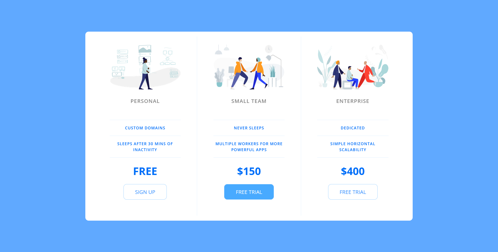

# Responsive Pricing Table Showcase Using Media Queries and Flexbox

<h3 align="center"><b>Pricing Table</b></h3>
 
 

This is a responsive pricing table design which was created during a web development bootcamp course on Udemy. This design showcases my skills in front-end development and my ability to create visually appealing and user-friendly interfaces. The pricing table is responsive, meaning it adjusts seamlessly to different screen sizes, ensuring a consistent and optimal user experience across devices.

## Preview
 

    
 

  

## Build with

-    
- 
- Flexbox
- Media Queries

## Tools Used

- 
- 

## Outcome

- Used HTML5 **semantic elements** for better readability and structure
- Tried to maintain **clean code**
- Used **flexbox and media-queries** for a responsive design
- **Cross tested** on Firefox and Chromium based browsers

## What I learned

- Developed a responsive pricing table design
- Improved skills in HTML, CSS, and responsive web design techniques
- Expanded knowledge in front-end development through practical application

## Author

